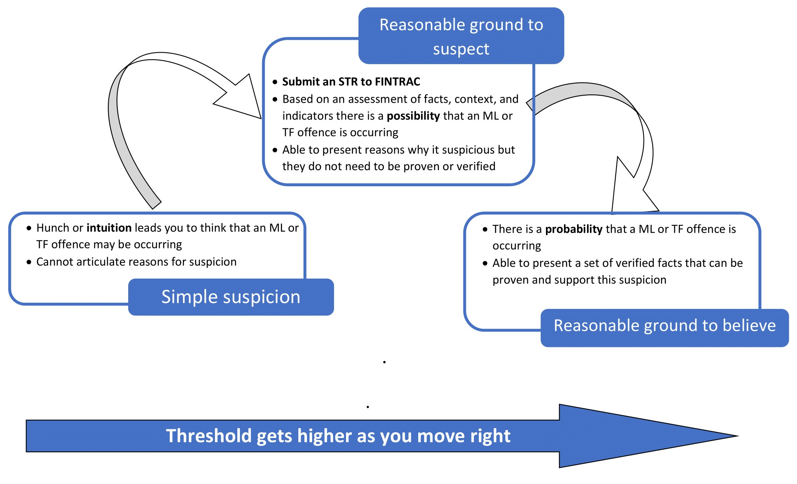

# Looking for Suspicious Transactions

 

*[What is a suspicious transaction report?](https://www.fintrac-canafe.gc.ca/guidance-directives/transaction-operation/Guide2/2-eng)

## Background

This analysis is requested by the firm's CFO. SQL skills us utilized to analyze the historical credit card transactions and consumption patterns in order to identify possible fraudulent transactions. This analysis will help the firm to identify potential fraudulent credit card transactions. The reports are generated based on the newly created fraud_detection database.

The following taks are accomplished:

1. Data Modeling:
        Define a database model to store the credit card transactions data and create a new PostgreSQL database using the model.

2. Data Engineering: 
        Create a database schema on PostgreSQL and populate the database from the CSV files provided.

3. Data Analysis: 
        Analyzing the data to identify possible fraudulent transactions trends data and develop a report.

## Note to CFO
  - Please note that file **CFO_ReadMe.md** has all the part 1 analysis. 
  - The directory **HM Files** has all the work files and .sql files
  - The directory **Starter_Files** has part 2 analysis and challenge analysis

---
